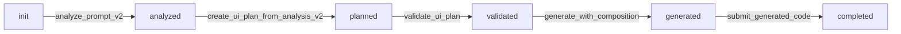

# Workflow Implementation Summary

## Проблемы, которые были решены

### 1. ❌ Анализ промпта не был обязательным
**Было:** ИИ мог пропустить `analyze_prompt_v2` и сразу создать невалидный UI-Plan

**Стало:** Workflow orchestrator блокирует попытки создать UI-Plan без предварительного анализа

### 2. ❌ Debug не работал
**Было:** `console.log()` шел в stdout, нарушая MCP протокол

**Стало:** Все debug логи теперь используют `console.error()` (stderr) через функцию `debugLog()`

### 3. ❌ ИИ мог пропустить этапы
**Было:** ИИ мог пытаться генерировать код без валидации UI-Plan

**Стало:** Строгая последовательность: analyze → create plan → validate → generate → submit

## Реализованные изменения

### Новые файлы

1. **`cli/ai-codegen/src/commands/mcp/workflow-orchestrator.ts`**
   - `WorkflowOrchestrator` класс для управления состоянием workflow
   - Проверка разрешений на выполнение инструментов
   - Автоматический переход между этапами
   - Глобальный `globalWorkflow` singleton

2. **`cli/ai-codegen/WORKFLOW.md`**
   - Полная документация по workflow
   - Примеры использования
   - Troubleshooting guide

### Изменения в существующих файлах

#### `cli/ai-codegen/src/commands/mcp/tool-schemas.ts`
- Добавлены схемы: `getWorkflowStatusSchema`, `startModuleWorkflowSchema`

#### `cli/ai-codegen/src/commands/mcp.ts`

**1. Debug Helper (строка 129-134):**
```typescript
const debugLog = (...args: any[]) => {
  if (debugMode) {
    console.error("[MCP DEBUG]", ...args);
  }
};
```

**2. Workflow Check (строка 354-388):**
```typescript
const workflowCheck = globalWorkflow.canExecuteTool(name);
if (!workflowCheck.allowed) {
  // Возвращает ошибку с инструкциями
}
```

**3. Workflow State Update (строка 395-398):**
```typescript
const trackSuccess = <T>(result: T): T => {
  metricsTracker.endToolCall(name, startTime, true);
  globalWorkflow.updateState(name, result); // ✅ Обновление состояния
  return result;
};
```

**4. Новые инструменты:**
- `get_workflow_status` (строка 2088-2122)
- `start_module_workflow` (строка 2124-2176)

**5. Обновленные описания инструментов:**
- `analyze_prompt_v2`: **⚠️ MANDATORY FIRST STEP ⚠️**
- `create_ui_plan_from_analysis_v2`: **⚠️ REQUIRES ANALYSIS ⚠️**
- `generate_with_composition`: **⚠️ REQUIRES VALIDATED UI-PLAN ⚠️**
- `generate_complete_module`: **⚠️ REQUIRES VALIDATED UI-PLAN ⚠️**

**6. Исправлены все debug логи:**
- `console.log()` → `debugLog()` или `console.error()`

## Как это работает

### Обязательная последовательность



### Блокировка неправильной последовательности

```typescript
// ИИ в состоянии "init" пытается создать UI-Plan
create_ui_plan_from_analysis_v2({ analysis: {} })

// ❌ Workflow orchestrator блокирует:
{
  "success": false,
  "error": "Workflow violation",
  "tool": "create_ui_plan_from_analysis_v2",
  "currentStep": "init",
  "reason": "Cannot create UI-Plan without analysis. Run analyze_prompt_v2 first.",
  "nextStep": "Use analyze_prompt_v2 to deeply analyze the user prompt",
  "suggestion": "You MUST follow the correct workflow sequence:..."
}
```

### Разрешенные инструменты на каждом этапе

| Этап | Разрешенные основные инструменты | Search tools |
|------|----------------------------------|--------------|
| `init` | `analyze_prompt_v2` | ✅ Все |
| `analyzed` | `create_ui_plan_from_analysis_v2` | ✅ Все |
| `planned` | `validate_ui_plan`, `validate_and_fix_plan` | ✅ Все |
| `validated` | `generate_with_composition`, `generate_complete_module` | ✅ Все |
| `generated` | `submit_generated_code`, `check_types` | ✅ Все |

## Примеры использования

### ✅ Правильный workflow

```typescript
// 1. Анализ (обязательно!)
analyze_prompt_v2({
  prompt: "Create offers management module with list and details"
})

// 2. Создание UI-Plan
create_ui_plan_from_analysis_v2({
  analysis: { /* результат из шага 1 */ }
})

// 3. Валидация
validate_ui_plan({
  plan: { /* результат из шага 2 */ }
})

// 4. Генерация
generate_with_composition({
  plan: { /* валидированный план */ },
  cwd: "/path/to/project"
})
```

### ✅ Использование guided workflow

```typescript
// Один инструмент для всего workflow
start_module_workflow({
  prompt: "Create offers management module",
  cwd: "/path/to/project"
})
// → Возвращает инструкции для анализа
// → После анализа автоматически предлагает следующий шаг
// → Продолжает до завершения генерации
```

### ❌ Неправильный workflow (блокируется)

```typescript
// Попытка пропустить анализ
generate_complete_module({
  plan: { /* hand-written plan */ },
  cwd: "/path/to/project"
})

// ❌ Ошибка:
// "Workflow violation: Cannot generate module without validated UI-Plan."
```

## Debug Mode

```bash
# Включить debug mode
DEBUG_MCP=true MCP_METRICS_FILE=/tmp/mcp-metrics.json npx @vc-shell/ai-codegen mcp

# Логи теперь идут в stderr:
# [MCP DEBUG] Tool call: analyze_prompt_v2 { prompt: '...' }
# [MCP DEBUG] After zod parse, rawPlan type: object
# [MCP DEBUG] Starting guided workflow for: Create offers module
```

## Проверка состояния workflow

```typescript
get_workflow_status()

// Возвращает:
{
  "workflow": {
    "currentStep": "analyzed",
    "nextStep": "Use create_ui_plan_from_analysis_v2 to create UI-Plan from analysis",
    "canProceed": true
  },
  "sequence": [
    { "step": 1, "tool": "analyze_prompt_v2", "status": "completed" },
    { "step": 2, "tool": "create_ui_plan_from_analysis_v2", "status": "pending" },
    ...
  ]
}
```

## Преимущества

1. ✅ **Предотвращает невалидные UI-Plans** - анализ обязателен
2. ✅ **Лучшее качество кода** - валидированные планы → лучший код
3. ✅ **Консистентный workflow** - все ИИ агенты следуют одной последовательности
4. ✅ **Понятные ошибки** - ИИ получает четкие инструкции при нарушении workflow
5. ✅ **Работающий debug** - логи корректно выводятся в stderr

## Тестирование

```bash
# 1. Собрать проект
cd /Users/symbot/DEV/vc-shell/cli/ai-codegen
yarn build

# 2. Протестировать workflow
# Попробуйте создать модуль через Claude Code/Cursor
# ИИ теперь будет следовать строгой последовательности
```

## Файлы изменений

- ✅ `cli/ai-codegen/src/commands/mcp/workflow-orchestrator.ts` (новый)
- ✅ `cli/ai-codegen/src/commands/mcp/tool-schemas.ts` (обновлен)
- ✅ `cli/ai-codegen/src/commands/mcp.ts` (обновлен)
- ✅ `cli/ai-codegen/WORKFLOW.md` (новый)
- ✅ `WORKFLOW_IMPLEMENTATION_SUMMARY.md` (этот файл)

## Следующие шаги

1. Коммит изменений
2. Тестирование в реальных сценариях
3. Документация для пользователей
4. Возможные улучшения:
   - Сохранение состояния workflow между сессиями
   - Поддержка нескольких параллельных workflow (разные модули)
   - Визуализация workflow в UI
   - Функция отката (undo)
