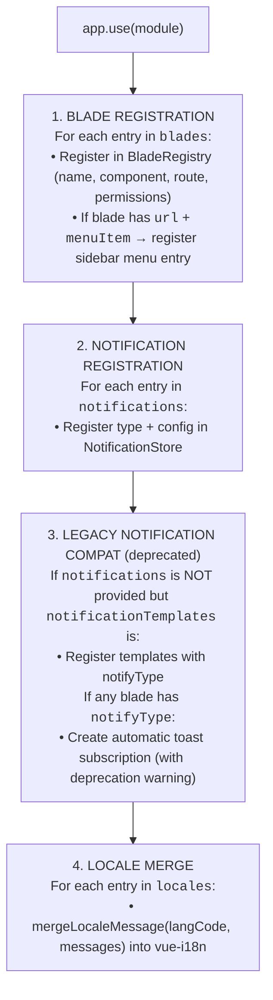
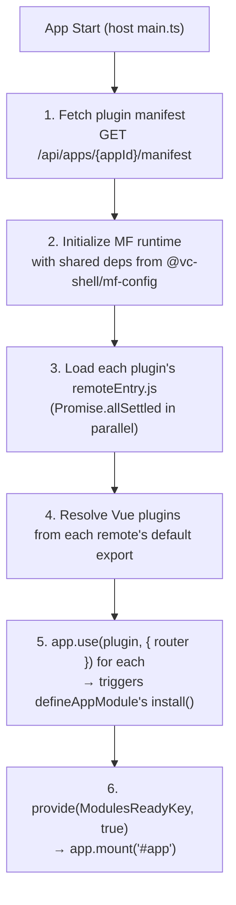

!!! tip "Navigation"
This page is long. Use the [Table of Contents](#table-of-contents) to jump to the section you need.

# Modularity Plugin

The modularity plugin is the backbone of every vc-shell application. It defines how features are packaged as **modules**, how those modules are registered at runtime, and how they integrate with the framework's blade navigation, localization, menu, and notification systems.

If you are building anything in vc-shell -- a new page, a CRUD flow, a dashboard widget, a notification handler -- you will start by creating a module.

## When to Use

- Package any feature as a self-contained unit with blades, menu items, locales, notifications, and permissions
- Every vc-shell feature starts here -- `defineAppModule()` is the entry point for all module development
- When NOT to use: for shared utilities or composables that have no UI -- export them as plain TypeScript modules instead

---

## Table of Contents

- [Quick Start](#quick-start)
- [Concepts](#concepts)
  - [What is a Module?](#what-is-a-module)
  - [Module Lifecycle](#module-lifecycle)
  - [defineAppModule vs createAppModule](#defineappmodule-vs-createappmodule)
- [Features](#features)
  - [defineAppModule API](#defineappmodule-api)
  - [Registering Blades](#registering-blades)
  - [Blade Static Properties](#blade-static-properties)
  - [Registering Menu Items](#registering-menu-items)
  - [Registering Notification Types](#registering-notification-types)
  - [Adding Locales](#adding-locales)
  - [Registering Dashboard Widgets](#registering-dashboard-widgets)
  - [Plugin Compatibility](#plugin-compatibility)
  - [Plugin Loading (Module Federation)](#plugin-loading-module-federation)
- [Recipes](#recipes)
  - [Minimal Module (Blades Only)](#minimal-module-blades-only)
  - [Module with CRUD Blades (List + Details)](#module-with-crud-blades-list--details)
  - [Module with Dashboard Widgets](#module-with-dashboard-widgets)
  - [Module Extending Another Module](#module-extending-another-module)
- [Common Mistakes](#common-mistakes)
- [API Reference](#api-reference)
- [Related](#related)

---

## Quick Start

Create a minimal module that registers one blade with a sidebar menu entry:

```typescript
// modules/my-feature/index.ts
import { defineAppModule } from "@vc-shell/framework";
import MyFeatureList from "./pages/MyFeatureList.vue";
import en from "./locales/en.json";

export default defineAppModule({
  blades: { MyFeatureList },
  locales: { en },
});
```

```vue
<!-- modules/my-feature/pages/MyFeatureList.vue -->
<template>
  <VcBlade title="My Feature">
    <p>Hello from my first module!</p>
  </VcBlade>
</template>

<script setup lang="ts">
import { VcBlade } from "@vc-shell/framework/ui";

defineBlade({
  name: "MyFeatureList",
  url: "/my-feature",
  isWorkspace: true,
  menuItem: {
    title: "MY_FEATURE.MENU.TITLE",
    icon: "lucide-star",
    priority: 50,
  },
});
</script>
```

`VcBlade` reads `expanded` and `closable` directly from the blade descriptor and emits its own close action — blade pages no longer declare those as props or wire up `@close` / `@expand` / `@collapse` emits.

```json
// modules/my-feature/locales/en.json
{
  "MY_FEATURE": {
    "MENU": { "TITLE": "My Feature" }
  }
}
```

The module is installed by the host application (or loaded remotely via Module Federation). When `app.use(module)` runs, vc-shell automatically:

1. Registers the blade in `BladeRegistry`
2. Creates a route for `/my-feature`
3. Adds "My Feature" to the sidebar menu
4. Merges English locale strings into vue-i18n

---

## Concepts

### What is a Module?

A module is a **Vue plugin** created by `defineAppModule()`. It bundles everything a feature needs:

| Asset                 | Purpose                                                           |
| --------------------- | ----------------------------------------------------------------- |
| **Blades**            | Vue components registered in `BladeRegistry` for blade navigation |
| **Locales**           | Translation objects merged into the global vue-i18n instance      |
| **Notifications**     | Notification type configurations for real-time push events        |
| **Dashboard widgets** | Cards displayed on the main dashboard (registered separately)     |

Modules are self-contained: each module declares its own routes, menu entries, permissions, and translations. The framework composes them at runtime.

```
my-feature-module/
  index.ts              # defineAppModule({ ... }) -- the module entry point
  pages/
    MyFeatureList.vue   # Workspace blade (list page)
    MyFeatureDetails.vue # Child blade (detail/edit page)
  composables/
    useMyFeature.ts     # Business logic composable
  components/
    MyDashboardCard.vue # Dashboard widget component
  notifications/
    MyEvent.vue         # Custom notification template
  locales/
    en.json
    de.json
```

### Module Lifecycle

When the host application calls `app.use(module)`, the `install()` function runs the following steps **synchronously and in order**:



> **Why this order matters:** Blades must be registered before anything references them (e.g., menu items link to blade routes). Notifications are independent. Locales come last because they are purely additive.

### defineAppModule vs createAppModule

`defineAppModule` is the current API. `createAppModule` is a **deprecated** backward-compatible wrapper.

```typescript
// OLD (deprecated) -- positional arguments, easy to mix up
export default createAppModule(pages, locales, notificationTemplates, components);

// NEW (recommended) -- named options, clear intent
export default defineAppModule({
  blades: pages,
  locales,
  notifications: {
    /* ... */
  },
});
```

Key differences:

|                   | `createAppModule`                       | `defineAppModule`                  |
| ----------------- | --------------------------------------- | ---------------------------------- |
| API style         | Positional args                         | Named options object               |
| Notifications     | `notificationTemplates` (legacy)        | `notifications` (new typed config) |
| Global components | 4th arg registers via `app.component()` | Not supported (use provide/inject) |
| Status            | **Deprecated** -- will be removed       | **Current** -- use this            |

Migration is a one-line change:

```typescript
// Before:
export default createAppModule(pages, locales);
// After:
export default defineAppModule({ blades: pages, locales });
```

---

## Features

### defineAppModule API

```typescript
import { defineAppModule } from "@vc-shell/framework";

export default defineAppModule({
  // Blade components to register in BladeRegistry
  blades: { OrdersList, OrderDetails },

  // Locale message objects keyed by language code
  locales: { en, de },

  // Notification type configurations (new API)
  notifications: {
    OrderChangedEvent: {
      toast: { mode: "auto" },
    },
  },

  // DEPRECATED: Legacy notification templates
  // notificationTemplates: { ... },
});
```

The function returns a standard Vue plugin object (`{ install(app) { ... } }`).

### Registering Blades

Blades are the fundamental UI unit in vc-shell -- stacked panels similar to the Azure Portal. Every page you see is a blade.

Pass blade components in the `blades` option:

```typescript
import ProductsList from "./pages/ProductsList.vue";
import ProductDetails from "./pages/ProductDetails.vue";

export default defineAppModule({
  blades: { ProductsList, ProductDetails },
});
```

Each blade is registered in the `BladeRegistry` with:

| Property      | Source                             | Description                                        |
| ------------- | ---------------------------------- | -------------------------------------------------- |
| `name`        | `component.name` or the export key | Unique identifier in the registry                  |
| `component`   | The Vue component itself           | Used to render the blade                           |
| `route`       | `component.url`                    | URL path for routable blades                       |
| `isWorkspace` | `component.isWorkspace`            | `true` = top-level blade (fills the workspace)     |
| `routable`    | `component.routable`               | `true` = gets a Vue Router route (default: `true`) |
| `permissions` | `component.permissions`            | Required permissions to access the blade           |

> **Tip:** The export key (e.g., `ProductsList` in `{ ProductsList }`) is used as a fallback name when `defineBlade` does not set a name. Always set `defineBlade({ name: "..." })` explicitly.

### Blade Static Properties

Blades declare their routing, permissions, and menu behavior through `defineBlade`:

```vue
<script setup lang="ts">
defineBlade({
  // REQUIRED: Unique name for the blade (used in BladeRegistry)
  name: "OrdersList",

  // URL path. If set, a Vue Router route is created automatically.
  url: "/orders",

  // true = this is a workspace (top-level) blade
  isWorkspace: true,

  // Whether this blade gets a router route. Default: true.
  // Set to false for child blades opened programmatically.
  routable: true,

  // Required permissions (array of permission strings)
  permissions: ["seller:orders:view"],

  // Sidebar menu configuration. Only used if `url` is also set.
  menuItem: {
    title: "ORDERS.MENU.TITLE", // i18n key or plain string
    icon: "lucide-shopping-cart", // Icon name (lucide or fas)
    priority: 1, // Lower = higher in menu
    permissions: ["seller:orders:view"], // Optional override
  },
});
</script>
```

> **Note:** `defineBlade` is compiled by the VC-Shell Vite plugin. It emits Vue component options and registers blade metadata before module installation.

**Child blades** (detail pages opened from a list) typically do NOT need `url`, `isWorkspace`, or `menuItem`:

```vue
<script setup lang="ts">
defineBlade({
  name: "OrderDetails",
  // No url, no menuItem -- this blade is opened programmatically via openBlade()
});
</script>
```

### Registering Menu Items

Menu items are created **automatically** when a blade has both `url` and `menuItem` static properties. You do not call any menu API yourself.

```vue
<script setup lang="ts">
defineBlade({
  name: "ProductsList",
  url: "/products",
  isWorkspace: true,
  menuItem: {
    title: "PRODUCTS.MENU.TITLE", // Resolved via vue-i18n
    icon: "lucide-package",
    priority: 10, // Sort order in the sidebar
  },
  permissions: ["seller:products:view"],
});
</script>
```

Under the hood, `defineAppModule` calls `addMenuItem()` from `useMenuService` with:

```typescript
addMenuItem({
  title: "PRODUCTS.MENU.TITLE",
  icon: "lucide-package",
  priority: 10,
  url: "/products",
  routeId: "ProductsList",
  permissions: ["seller:products:view"],
});
```

The `permissions` array on the blade component flows through to both the route guard and the menu item visibility. If the current user lacks the required permissions, the menu item is hidden and the route is blocked.

### Registering Notification Types

vc-shell supports real-time push notifications via SignalR. Modules register the notification types they handle:

```typescript
import OrderNotification from "./notifications/OrderNotification.vue";

export default defineAppModule({
  blades: { OrdersList },
  notifications: {
    // Simple: auto-show a toast when this event arrives
    OrderCreatedEvent: {
      toast: { mode: "auto" },
    },

    // With custom template and severity
    OrderFailedEvent: {
      template: OrderNotification,
      toast: { mode: "auto", severity: "error" },
    },

    // Progress-style toast (e.g., long-running export)
    ExportProgressEvent: {
      toast: {
        mode: "progress",
        isComplete: (msg) => msg.finished === true,
        completedType: (msg) => (msg.errorCount > 0 ? "error" : "success"),
      },
    },

    // Silent: stored in history, no toast
    AuditLogEvent: {
      toast: false,
    },
  },
});
```

**`NotificationTypeConfig` options:**

| Field      | Type                   | Description                                                  |
| ---------- | ---------------------- | ------------------------------------------------------------ |
| `toast`    | `ToastConfig \| false` | Toast display behavior. `false` = no toast (silent).         |
| `template` | `Component`            | Custom Vue component for rendering in the notification panel |
| `groupBy`  | `string`               | Group notifications by this field value                      |

**`ToastConfig` options:**

| Field           | Type                               | Default           | Description                                                                           |
| --------------- | ---------------------------------- | ----------------- | ------------------------------------------------------------------------------------- |
| `mode`          | `"auto" \| "progress" \| "silent"` | required          | `auto` = show and auto-dismiss; `progress` = stay until complete; `silent` = no toast |
| `severity`      | `Severity \| (msg) => Severity`    | `"info"`          | Toast type: `"info"`, `"success"`, `"warning"`, `"error"`                             |
| `timeout`       | `number`                           | varies            | Auto-dismiss timeout in milliseconds                                                  |
| `isComplete`    | `(msg) => boolean`                 | `msg.finished`    | For `progress` mode: when to close the toast                                          |
| `completedType` | `(msg) => "success" \| "error"`    | `() => "success"` | For `progress` mode: final toast type                                                 |

### Adding Locales

Locales are JSON objects keyed by language code. They are merged into the global vue-i18n instance during module installation:

```typescript
import en from "./locales/en.json";
import de from "./locales/de.json";

export default defineAppModule({
  blades: { ProductsList },
  locales: { en, de },
});
```

```json
// locales/en.json
{
  "PRODUCTS": {
    "MENU": { "TITLE": "Products" },
    "PAGES": {
      "LIST": {
        "TITLE": "Products List",
        "TABLE": {
          "HEADER": {
            "NAME": "Name",
            "PRICE": "Price",
            "STATUS": "Status"
          },
          "TOTALS": "Total products"
        },
        "EMPTY": {
          "NO_ITEMS": "No products found"
        }
      }
    }
  }
}
```

**Convention:** Use `MODULE_NAME.PAGES.PAGE_NAME.SECTION.KEY` as the namespace pattern. This avoids collisions between modules.

Use translations in templates and scripts:

```vue
<template>
  <VcBlade :title="$t('PRODUCTS.PAGES.LIST.TITLE')">
    <!-- ... -->
  </VcBlade>
</template>

<script setup lang="ts">
import { useI18n } from "vue-i18n";
const { t } = useI18n({ useScope: "global" });
const title = t("PRODUCTS.PAGES.LIST.TITLE");
</script>
```

### Registering Dashboard Widgets

Dashboard widgets are registered separately from `defineAppModule`, using `registerDashboardWidget()`. This function uses a pre-registration bus, so it can be called at **module top-level** (before the Vue app is mounted):

```typescript
// modules/orders/index.ts
import { defineAppModule, registerDashboardWidget } from "@vc-shell/framework";
import { markRaw } from "vue";
import * as pages from "./pages";
import * as locales from "./locales";
import OrdersDashboardCard from "./components/OrdersDashboardCard.vue";

// Register the widget BEFORE defineAppModule
registerDashboardWidget({
  id: "orders-widget",
  name: "Orders",
  component: markRaw(OrdersDashboardCard),
  size: { width: 6, height: 6 },
  // permissions: ["seller:orders:view"],  // Optional: permission-gated
});

export default defineAppModule({ blades: pages, locales });
```

> **Important:** Always wrap the component with `markRaw()` to prevent Vue from making the component definition reactive (which causes performance issues and warnings).

**`DashboardWidget` options:**

| Field         | Type                                | Description                              |
| ------------- | ----------------------------------- | ---------------------------------------- |
| `id`          | `string`                            | Unique widget identifier                 |
| `name`        | `string`                            | Display name                             |
| `component`   | `Component`                         | Vue component to render                  |
| `size`        | `{ width: number; height: number }` | Grid size                                |
| `position`    | `{ x: number; y: number }`          | Initial grid position (optional)         |
| `permissions` | `string[]`                          | Required permissions (optional)          |
| `props`       | `Record<string, unknown>`           | Props passed to the component (optional) |

### Plugin Compatibility

Plugin compatibility is settled on the Platform side, not in the browser. The Platform validates each plugin's `<dependency>` declarations in **module.manifest** at .NET module install time and refuses incompatible installs. By the time a plugin appears in the manifest endpoint, the dependency graph has already approved it — there is no client-side semver filter.

Upgrading the host's framework does not silently drop older plugins; if a plugin becomes incompatible, the Platform admin sees an install-time error first.

### Plugin Loading (Module Federation)

vc-shell loads plugin extensions at runtime via Module Federation. A plugin remote is built by a .NET module's Vue subpackage and discovered by the Platform from the dependency graph. The host fetches a manifest of plugins for its `appId` at boot and installs each as a Vue plugin.

The loading sequence:



Non-OK manifest responses (401 / 403 / 404 / 5xx) are treated as "no plugins" — the host logs a `console.warn`, sets `modulesReady=true`, and mounts without extensions. Only network or parse failures set `modulesLoadError=true`.

See the [Module Federation guide](../guides/module-federation/index.md) for the full plugin-author + host-app walkthrough.

The host shares singleton instances of core dependencies (Vue, Vue Router, vue-i18n, @vc-shell/framework) so that remote modules use the same runtime. This is critical for reactivity, routing, and DI to work across module boundaries.

---

## Recipes

### Minimal Module (Blades Only)

The simplest possible module -- one blade, no locales, no notifications:

```typescript
// modules/hello/index.ts
import { defineAppModule } from "@vc-shell/framework";
import HelloWorld from "./pages/HelloWorld.vue";

export default defineAppModule({
  blades: { HelloWorld },
});
```

### Module with CRUD Blades (List + Details)

A typical business module with a workspace list blade and a child details blade:

```typescript
// modules/products/index.ts
import { defineAppModule, registerDashboardWidget } from "@vc-shell/framework";
import { markRaw } from "vue";
import ProductsList from "./pages/ProductsList.vue";
import ProductDetails from "./pages/ProductDetails.vue";
import ProductsDashboardCard from "./components/ProductsDashboardCard.vue";
import ProductCreatedEvent from "./notifications/ProductCreatedEvent.vue";
import en from "./locales/en.json";
import de from "./locales/de.json";

registerDashboardWidget({
  id: "products-widget",
  name: "Last products",
  component: markRaw(ProductsDashboardCard),
  size: { width: 6, height: 6 },
});

export default defineAppModule({
  blades: { ProductsList, ProductDetails },
  locales: { en, de },
  notifications: {
    ProductCreatedDomainEvent: {
      template: ProductCreatedEvent,
      toast: { mode: "auto" },
    },
  },
});
```

The list blade (workspace):

```vue
<!-- pages/ProductsList.vue -->
<script setup lang="ts">
import { useBlade } from "@vc-shell/framework";
import { VcBlade, VcDataTable, VcColumn } from "@vc-shell/framework/ui";
import useProducts from "../composables/useProducts";

defineBlade({
  name: "ProductsList",
  url: "/products",
  isWorkspace: true,
  permissions: ["seller:products:view"],
  menuItem: {
    title: "PRODUCTS.MENU.TITLE",
    icon: "lucide-package",
    priority: 10,
  },
});

const { openBlade } = useBlade();
const { items, loading, totalCount, load } = useProducts();

function onRowClick(item: any) {
  openBlade({
    blade: "ProductDetails",
    options: { productId: item.id },
  });
}
</script>
```

The details blade (child):

```vue
<!-- pages/ProductDetails.vue -->
<script setup lang="ts">
import { VcBlade } from "@vc-shell/framework/ui";

defineBlade({
  name: "ProductDetails",
  // No url, no menuItem -- opened programmatically
});

const props = defineProps<{
  param?: { productId: string };
  closable?: boolean;
}>();

defineEmits(["close:blade"]);
</script>
```

### Module with Dashboard Widgets

```typescript
// modules/analytics/index.ts
import { defineAppModule, registerDashboardWidget } from "@vc-shell/framework";
import { markRaw } from "vue";
import SalesChart from "./components/SalesChart.vue";
import RevenueCard from "./components/RevenueCard.vue";

registerDashboardWidget({
  id: "sales-chart",
  name: "Sales Overview",
  component: markRaw(SalesChart),
  size: { width: 12, height: 8 },
  position: { x: 0, y: 0 },
});

registerDashboardWidget({
  id: "revenue-card",
  name: "Revenue",
  component: markRaw(RevenueCard),
  size: { width: 6, height: 4 },
  permissions: ["analytics:revenue:view"],
});

// Module can have no blades -- just dashboard widgets
export default defineAppModule({});
```

### Module Extending Another Module

A module can extend another module's UI by using extension points (see the [Extension Points Plugin](../extension-points/extension-points.docs.md)):

```typescript
// modules/marketplace-commissions/index.ts
import { defineAppModule, useExtensionPoint } from "@vc-shell/framework";
import CommissionFields from "./components/CommissionFields.vue";
import en from "./locales/en.json";

// Register into the seller details extension point
const { add } = useExtensionPoint("seller:commissions");
add({
  id: "marketplace-commission",
  component: CommissionFields,
  props: { showAdvanced: true },
  priority: 10,
});

export default defineAppModule({
  locales: { en },
});
```

The host blade declares the extension point:

```vue
<!-- In seller-details-edit.vue (another module) -->
<template>
  <VcBlade title="Seller Details">
    <form><!-- main form fields --></form>

    <!-- Other modules can inject components here -->
    <ExtensionPoint
      v-if="sellerDetails?.id"
      name="seller:commissions"
      wrapper-class="tw-p-2"
    />
  </VcBlade>
</template>

<script setup lang="ts">
import { ExtensionPoint } from "@vc-shell/framework";
</script>
```

---

## Common Mistakes

### Forgetting `defineBlade` on a blade

```typescript
// module/index.ts
export default defineAppModule({
  blades: { MyBlade },
});
```

```vue
<!-- MyBlade.vue -->
<script setup lang="ts">
// No defineBlade!
</script>
```

The blade will be registered with the export key (`"MyBlade"`) as its name, but it will have **no route and no menu entry** because `defineBlade` is what writes routing, permissions, and menu config into the blade config registry. Always call `defineBlade({ name, url?, menuItem?, ... })` at the top of `<script setup>`.

### Using `createAppModule` with the new notifications API

```typescript
// createAppModule does not accept `notifications` -- it uses notificationTemplates
export default createAppModule(pages, locales, notificationTemplates);

// Migrate to defineAppModule:
export default defineAppModule({
  blades: pages,
  locales,
  notifications: {
    /* ... */
  },
});
```

### Forgetting `markRaw()` on dashboard widget components

```typescript
// WRONG -- Vue will make the component reactive, causing warnings
registerDashboardWidget({
  id: "my-widget",
  component: MyWidget, // Missing markRaw!
  ...
});

// CORRECT
import { markRaw } from "vue";
registerDashboardWidget({
  id: "my-widget",
  component: markRaw(MyWidget),
  ...
});
```

### Duplicate blade names across modules

```typescript
// Module A
export default defineAppModule({
  blades: { Dashboard: DashboardA },
});

// Module B
export default defineAppModule({
  blades: { Dashboard: DashboardB }, // Throws at install time!
});
```

`BladeRegistry` throws when a name is registered twice: `Blade 'Dashboard' is already registered`. The error halts module installation, so duplicate names are caught at startup rather than silently shadowing each other. Use descriptive, module-prefixed names: `OrdersDashboard`, `ProductsDashboard`.

### Locale key collisions

```json
// Module A: locales/en.json
{ "SHARED": { "SAVE": "Save" } }

// Module B: locales/en.json
{ "SHARED": { "SAVE": "Submit" } }  // Overwrites Module A's key!
```

Always namespace locale keys under your module name: `ORDERS.ACTIONS.SAVE`, `PRODUCTS.ACTIONS.SAVE`.

---

## API Reference

### `defineAppModule(options): Plugin`

Creates a Vue plugin that registers all module assets during `install()`.

**Parameters:**

```typescript
interface DefineAppModuleOptions {
  /** Blade components to register in BladeRegistry */
  blades?: Record<string, BladeInstanceConstructor>;

  /** Locale message objects keyed by language code (e.g. { en, de }) */
  locales?: Record<string, object>;

  /** Notification type configurations */
  notifications?: ModuleNotificationsConfig;

  /** @deprecated Use `notifications` instead */
  notificationTemplates?: Record<string, Component & { notifyType?: string }>;
}
```

**Returns:** `{ install(app: App): void }` -- a standard Vue plugin.

---

### `createAppModule(pages, locales?, notificationTemplates?, components?): Plugin`

> **Deprecated.** Backward-compatible wrapper that delegates to `defineAppModule()`.

**Parameters:**

| #   | Parameter               | Type                                       | Description                                       |
| --- | ----------------------- | ------------------------------------------ | ------------------------------------------------- |
| 1   | `pages`                 | `Record<string, BladeInstanceConstructor>` | Blade components                                  |
| 2   | `locales`               | `Record<string, object>`                   | Locale objects (optional)                         |
| 3   | `notificationTemplates` | `Record<string, Component>`                | Legacy notification templates (optional)          |
| 4   | `components`            | `Record<string, Component>`                | Global components (optional, ignored in new impl) |

---

### `registerDashboardWidget(widget): void`

Registers a dashboard widget. Can be called at module top-level before the Vue app mounts (uses a pre-registration bus).

```typescript
interface DashboardWidget {
  id: string;
  name: string;
  component: Component;
  size: { width: number; height: number };
  position?: { x: number; y: number };
  permissions?: string[];
  props?: Record<string, unknown>;
}
```

---

### Blade Static Properties (defineOptions)

| Property      | Type             | Default     | Description                           |
| ------------- | ---------------- | ----------- | ------------------------------------- |
| `name`        | `string`         | export key  | Unique blade identifier               |
| `url`         | `string`         | `undefined` | URL path for routing                  |
| `isWorkspace` | `boolean`        | `false`     | Top-level workspace blade             |
| `routable`    | `boolean`        | `true`      | Whether a Vue Router route is created |
| `permissions` | `string[]`       | `undefined` | Required access permissions           |
| `menuItem`    | `MenuItemConfig` | `undefined` | Sidebar menu configuration            |

**`MenuItemConfig`:**

| Field         | Type       | Description                                                     |
| ------------- | ---------- | --------------------------------------------------------------- |
| `title`       | `string`   | Display text or i18n key                                        |
| `icon`        | `string`   | Icon name (lucide-_ or fas fa-_)                                |
| `priority`    | `number`   | Sort order (lower = higher in menu)                             |
| `permissions` | `string[]` | Permission override (optional, falls back to blade permissions) |

---

### `NotificationTypeConfig`

```typescript
interface NotificationTypeConfig {
  /** Custom Vue component for the notification panel */
  template?: Component;

  /** Toast display config, or `false` to suppress toasts */
  toast: ToastConfig | false;

  /** Group key for notification grouping */
  groupBy?: string;
}
```

### `ToastConfig`

```typescript
interface ToastConfig {
  mode: "auto" | "progress" | "silent";
  severity?: Severity | ((msg: PushNotification) => Severity);
  timeout?: number;
  isComplete?: (msg: PushNotification) => boolean;
  completedType?: (msg: PushNotification) => "success" | "error";
}
```

---

## Related

| Resource                | Path                                  | Description                                      |
| ----------------------- | ------------------------------------- | ------------------------------------------------ |
| Extension Points Plugin | `core/plugins/extension-points/`      | Cross-module UI extension system                 |
| BladeRegistry           | `core/composables/useBladeRegistry/`  | Where blades are stored and looked up            |
| useMenuService          | `core/composables/useMenuService/`    | `addMenuItem()` for sidebar navigation           |
| useDashboard            | `core/composables/useDashboard/`      | Dashboard widget management                      |
| NotificationStore       | `core/notifications/`                 | Notification type registration and dispatch      |
| i18n Plugin             | `core/plugins/i18n/`                  | vue-i18n singleton for locale merging            |
| mf-host                 | `packages/mf-host/`                   | Module Federation host that loads remote modules |
| Blade Navigation        | `shared/components/blade-navigation/` | Blade stack rendering and navigation             |
