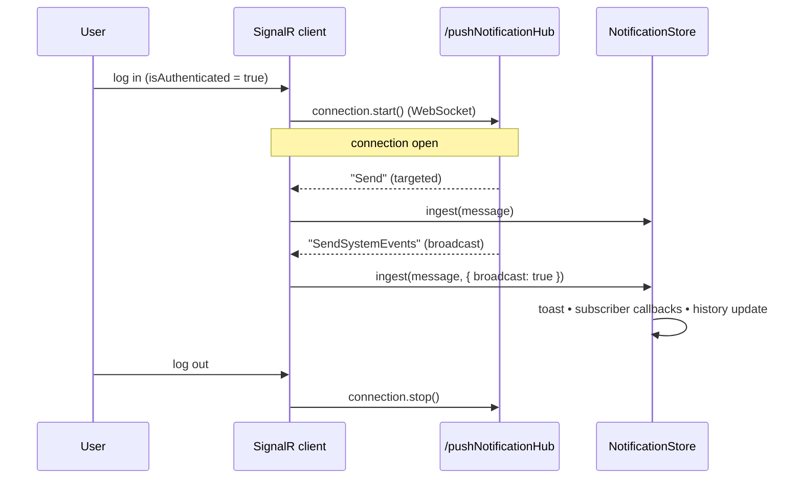

# SignalR Plugin

Real-time push notification transport via ASP.NET SignalR. Connects to the platform's `/pushNotificationHub` and routes incoming messages to the notification store.

## Overview

## When to Use

- Receive real-time push notifications from the platform (order updates, export progress, background job status)
- Display live notification toasts and badge counts without polling
- When NOT to use: for request-response API calls -- use `useApiClient`; for periodic data refresh -- use polling with `useAsync` instead

The VirtoCommerce platform uses ASP.NET SignalR to push real-time notifications to connected clients. These notifications cover events like order status changes, catalog exports completing, background job progress, and system alerts.

The SignalR plugin establishes a persistent WebSocket connection to the platform hub and listens for two event channels:

- **`Send`** -- targeted messages ingested with default routing
- **`SendSystemEvents`** -- ingested as broadcast (`store.ingest(message, { broadcast: true })`), no creator filtering

Incoming messages are ingested into the `NotificationStore`, which dispatches them to registered notification type handlers and triggers toast notifications based on per-type configuration.

The connection lifecycle is tied to the user's authentication state: it connects on login, disconnects on logout, and auto-reconnects on connection loss.

## Installation / Registration

```typescript
// Automatic -- installed by the framework during app setup.
// The plugin takes no options.
app.use(signalR);
```

Module developers do not install this plugin. It is registered once by the framework during bootstrap.

## API

### Exports

| Export    | Type     | Description                               |
| --------- | -------- | ----------------------------------------- |
| `signalR` | `Plugin` | Vue plugin object with `install()` method |

The plugin installs with no options: `app.use(signalR)`.

## Connection Lifecycle



### Reconnection Behavior

- **Built-in**: The `HubConnectionBuilder` is configured with `.withAutomaticReconnect()`, which handles transient disconnects
- **Manual fallback**: If `connection.start()` fails, a `setTimeout` retries after 5 seconds
- **`onclose` handler**: When the connection closes and the user is still authenticated (`reconnect = true`), it restarts automatically
- **Logout cleanup**: Setting `reconnect = false` before `stop()` prevents reconnection after intentional disconnection

## Usage

### How Messages Flow

1. Platform sends a `PushNotification` via SignalR
2. The plugin's `Send` or `SendSystemEvents` handler receives it
3. `store.ingest(message)` dispatches to the `NotificationStore`
4. Registered notification type handlers (from `defineAppModule({ notifications })`) process the message
5. Toast notifications appear based on the type's `toast.mode` configuration (`"auto"`, `"progress"`, or `"silent"`)

### Reacting to Notifications in a Blade

Module developers typically do not interact with SignalR directly. Instead, use `useBladeNotifications()` to subscribe to specific notification types:

```typescript
import { useBladeNotifications } from "@vc-shell/framework";

const { messages, unreadCount } = useBladeNotifications({
  types: ["CatalogExportCompleted"],
  filter: (msg) => msg.jobId === currentJobId.value,
  onMessage: (msg) => {
    if (msg.finished) {
      reloadExportResults();
    }
  },
});
```

### Testing with Cypress

The plugin supports Cypress mock via `cypress-signalr-mock`. When running in a Cypress environment or Vitest, the mock replaces the real SignalR connection, allowing you to simulate push notifications in tests:

```typescript
// In a Cypress test:
cy.signalR("pushNotificationHub").invoke("Send", {
  id: "test-1",
  notifyType: "OrderStatusChanged",
  title: "Order #123 shipped",
  isNew: true,
});
```

## Tip: Send vs. SendSystemEvents

Both channels ingest into the same `NotificationStore`. `Send` messages are ingested with default routing; `SendSystemEvents` messages are ingested as broadcast (`{ broadcast: true }`). The plugin does not filter either channel by a creator field -- any scoping to a specific user or organization must happen server-side before the message is pushed.

## Related

- `framework/core/notifications/` -- `NotificationStore` that receives ingested messages
- `framework/core/plugins/modularity/` -- modules register notification types that handle SignalR messages
- `framework/core/composables/useUserManagement/` -- provides `isAuthenticated` reactive ref
- `framework/core/notifications/composables/useBladeNotifications.ts` -- blade-scoped notification subscription
